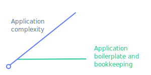

 
# Micrograph
 [](https://codecov.io/gh/dylnslck/micrograph)

Micrograph is a small (~375 LOC) library that makes developing large GraphQL applications with complex business logic pretty easy. Micrograph generalizes root queries and root mutations across every type in your data model. In other words, you can bootstrap a pretty large GraphQL application by writing a few functions. Afterwords, you can continue to add/modify types in your data model without adding and linking GraphQL-specific object types.

Micrograph supports middleware hooks so that you can easily intercept queries and mutations:

```js
import { createMiddleware } from 'micrograph';

const middleware = createMiddleware();

middleware.before('createUser', (args, ctx, next) {
  if (!isAuthenticated(ctx.req.headers.authorization)) {
    throw new Error('Unauthorized');
  }

  next();
});

export default middleware;
```

Micrograph is still in **beta** and the API may change over time. I've used it in production, but I generally don't recommend it until the API completely stabilizes.

## The gist {#the-gist}
Micrograph requires the creation of two files: `schema.js` and `queries.js`. You can optionally create two more files: `mutations.js` and `middleware.js`. The [tutorial](tutorial.md) explains creating these files. Micrograph compiles these files into a `GraphQLSchema` that can be plugged into your favorite GraphQL server library. These files enable your application to grow by focusing on things that matter, such as middleware and schema types.

For example, let's say your data model includes users and blogs. You'll [define your schema](tutorial/define-the-schema.md), [create some root queries and mutations](tutorial/root-queries-and-mutations.md), and specify some [middleware](tutorial/middleware.md). A week later, you decide to add more types to your data model. With Micrograph, you simply need to edit your `schema.js` and add some more middleware hooks if you choose. You don't need to add more root queries or root mutations - Micrograph automatically takes care of that.



Your app's complexity can grow without worrying about creating new GraphQL input types, object types, etc.

## Getting started {#getting-started}
First, install the Micrograph package. Micrograph relies on the [cohere](https://github.com/directlyio/cohere) schema library, so install that as well. `cohere` is a simple ~250 LOC schema lib.

```sh
npm install micrograph cohere graphql --save
```

Now, we need to define the schema, queries, mutations, and middleware. These steps are outlined in the tutorial.

## Documentation {#documentation}
1. [Tutorial](tutorial.md)
  1. [Define your business-logic layer](tutorial/define-business-logic.md)
  2. [Define your schema](tutorial/define-the-schema.md)
  3. [Root queries and mutations](tutorial/root-queries-and-mutations.md)
  4. [Middleware](tutorial/middleware.md)
  5. [Wire everything together](tutorial/wire-everything-together.md)
2. [Data modeling](data-modeling.md)
3. [API](api-reference.md)
  1. [compile](api/compile.md)
  2. [createMiddleware](api/create-middleware.md)
